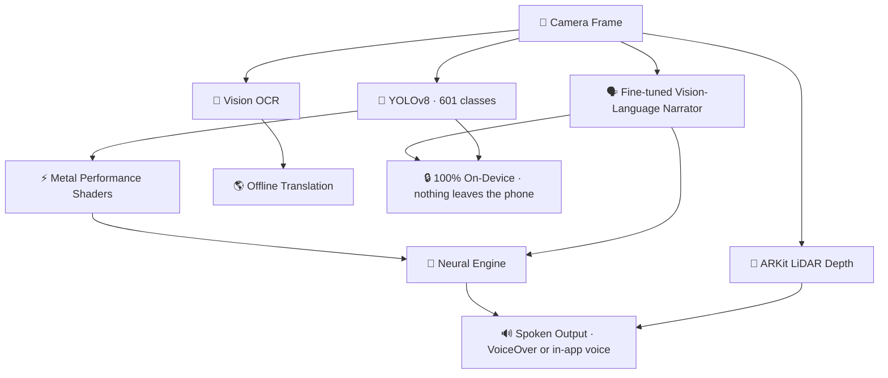
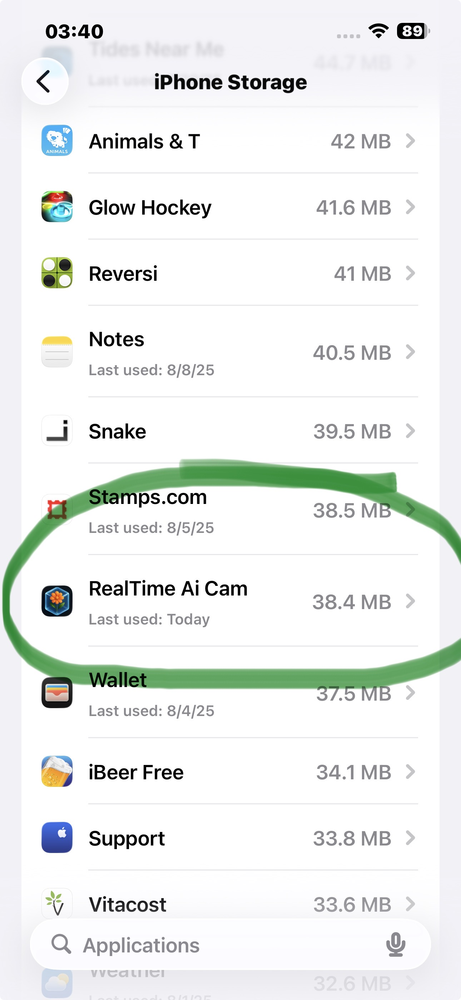
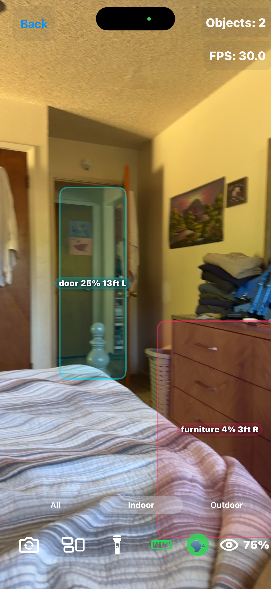

<div align="center">

# ✨ RealTime AI Camera ✨

### 👁️ A camera that tells you what it sees — out loud, offline, on your phone.

Point it at something and it names it. Hold it up to a bill and it reads the bill.
Press one button and it describes the whole room in a sentence you can act on.
**No account. No signal. No server. Nothing ever leaves the phone.**

### [](https://apps.apple.com/us/app/id6751230739) [](https://play.google.com/store/apps/details?id=com.mattmacosko.realtimeaicam)

**Free on [iPhone](https://apps.apple.com/us/app/id6751230739) and [Android](https://play.google.com/store/apps/details?id=com.mattmacosko.realtimeaicam) — no ads, no subscription, nothing to buy inside.**

<br>


</div>

---

## 🗣️ The part that matters most

<div align="center">

### **Press *What's this?* and the phone talks back.**

</div>

It speaks one to three plain sentences about what the camera is actually looking at —
where you are, what's near you and on which side, people, anything moving, hazards.
Point it at mail and it leads with **what the page is and who sent it**, then the number
that matters, then the deadline, then what happens if it's ignored.

This runs on a **small vision-language model that was fine-tuned for this one job and ships
inside the app** instead of calling somebody's server. That's most of why the download is
large, and it's the whole point. It works in airplane mode, on a plane, in a basement, in a
country where your data plan doesn't.

> **It never refuses a shot.** Dark, blurry, cut off — it says so in a few words and then
> describes whatever it can make out anyway. It will not hand the picture back and tell you
> to take another one.

---

## ♿ Built for VoiceOver and TalkBack

This app is used every day by blind and low-vision people. The accessibility work isn't a
checkbox at the end, it *is* the product.

<table>
<tr>
<td width="50%">

### 🔔 **Hands off the shutter**
A spoken countdown before the photo. Tap once, it counts **three, two, one** out loud with
a tap you can feel each second, then fires — so your hand is off the phone at the moment it
takes the picture. Pressing the button was what blurred the shot.

### 🎙️ **Your voice, or its voice**
A switch hands every spoken line to VoiceOver or TalkBack instead, so you hear it in your
voice at your speed and nothing talks over anything.

</td>
<td width="50%">

### 🗂️ **Every voice your phone has**
Not a short list of favourites. Voices you install or enable yourself show up, and the list
scrolls.

### 🔦 **One-tap flashlight**
Full brightness on the first tap. No brightness menu to get through first.

### 🖼️ **Describe photos you already have**
Straight from your library, not just what the camera is pointed at.

</td>
</tr>
</table>

Every control is labelled, and the labels say **what the thing does**, not what it's called.

Feature requests from the [AppleVis](https://www.applevis.com/) community are credited by name
in the commit history and in the source comments. If something is unlabelled, read in the wrong
order, or just not useful — say so, and it gets fixed.

---

## ✨ Everything it does

<table>
<tr>
<td width="50%">

### 🎯 **Sees**
- 🗣️ **Scene & page description** — the fine-tuned on-device narrator
- 🐶 **Object detection** — YOLOv8, **601 classes** from Open Images V7
- 🏠 **Indoor / outdoor modes** — swaps the whole list of things the detector may name, so your bathroom stops containing a skyscraper
- 📏 **LiDAR distance** — per-object depth on Pro models

</td>
<td width="50%">

### 📖 **Reads**
- 📝 **Live English OCR** — printed text, out loud, no shutter press
- ✉️ **Mail & bill mode** — what it is, who sent it, the amount, the deadline
- 🌎 **Spanish → English** — offline translation of signs and labels
- 🔊 **Speaks it all aloud** — in its voice or in yours

</td>
</tr>
</table>

---

## ⚡ How it's put together



| Component | Technology | Purpose |
|---|---|---|
| 🗣️ **Narrator** | Fine-tuned vision-language model, 4-bit, bundled | Scene and page description |
| 🤖 **Detector** | YOLOv8 (Ultralytics) | 601-class object detection |
| 🏗️ **UI** | SwiftUI (iOS) · Jetpack Compose (Android) | Native interface on both |
| ⚡ **Acceleration** | CoreML + Metal + Neural Engine · TensorFlow Lite | Hardware-optimized inference |
| 📊 **Dataset** | Open Images V7 | The 601 classes |
| 📏 **Depth** | ARKit LiDAR | Per-object distance |
| 🔋 **Optimization** | Thermal & battery aware, adaptive frame rate | Runs all day |

---

## 🔒 Privacy guarantee

<div align="center">

### 🛡️ **Your data never leaves your device**

| Privacy Feature | Status | Description |
|---|---|---|
| 📊 **Data Collection** | ❌ **NONE** | Zero telemetry or analytics |
| 🌐 **Internet Required** | ❌ **NO** | Works in airplane mode |
| 📍 **Location Tracking** | ❌ **NEVER** | No GPS or location access |
| 🏢 **Cloud Processing** | ❌ **NONE** | 100% on-device AI, model included |
| 👤 **Account Required** | ❌ **NONE** | Install and use it |
| 🔐 **Data Encryption** | ✅ **Built-in** | OS secure enclave protection |

**🔐 Privacy is non-negotiable. Everything happens locally.**

</div>

---

## 📸 Screenshots

<div align="center">

| 🌎 **Translation** | 🐶 **Detection** | 🏠 **Home Screen** | 📱 **App Info** | 📏 **LiDAR Distance** |
| --- | --- | --- | --- | --- |
|  |  |  |  |  |
| *Offline Spanish→English* | *601 object classes* | *Clean, native UI* | *Lightweight install* | *Pro model depth sensing* |

</div>

---

## 📦 Both platforms, one repo

### 📱 iOS — [`ios/`](ios/)

SwiftUI, CoreML, Metal and the Neural Engine. Full source, the Xcode project, and the YOLOv8
CoreML model.

**Status:** ✅ [Live on the App Store](https://apps.apple.com/us/app/id6751230739), free.

### 🤖 Android — [`android/`](android/)

The Android port: TensorFlow Lite YOLOv8 across the same 601 classes, with the model and the
conversion tooling included.

**Status:** ✅ [Live on Google Play](https://play.google.com/store/apps/details?id=com.mattmacosko.realtimeaicam), free.

---

## 🚀 Getting started

### 📋 **Requirements**
- **Device:** iPhone with **iOS 17+** — the download is around **700 MB** because the narrator model is inside the app
- **Optional:** a LiDAR-equipped iPhone for distance measurement
- **Development:** macOS with Xcode 16+

### ⚙️ **Quick setup**
```bash
# 1. Clone the repository
git clone https://github.com/nicedreamzapp/RealTimeAICam.git

# 2. Navigate to the iOS project
cd RealTimeAICam/ios

# 3. Open in Xcode
open "RealTime Ai Cam.xcodeproj"

# 4. Connect your iPhone and build!
```

### 🔑 **Required permissions**
- 📷 **Camera** — required, it's a camera
- 🖼️ **Photo library** — optional, to describe pictures you already have
- 📐 **Motion / Depth** — optional, for LiDAR distance

---

## 🔧 Advanced customization

<details>
<summary>🤖 <strong>Swap the YOLOv8 model</strong> (click to expand)</summary>

<br>

1. **Replace the model file**
   ```
   /Models/YOLOv8.mlpackage  →  YourCustomModel.mlpackage
   ```

2. **Update the processor**
   - Modify `YOLOv8Processor.swift` if input/output shapes differ
   - Adjust the class labels in `class_names.txt`
   - If you change the class list, update the indoor/outdoor sets in `YOLOv8Processor.swift` too, or the filters will drop classes that no longer exist

3. **Large models**
   - Use **Git LFS** for models over 100 MB
   - Consider quantization for better performance

### ⚡ **Performance tuning**
- Adjust inference frequency in the camera pipeline
- Modify confidence thresholds for different use cases
- Enable or disable features based on device capability

</details>

---

## 🤝 Contributing

<div align="center">

### 🌟 **Contributions welcome** 🌟

</div>

**📝 Before submitting a PR, please include:**
- 📱 Device model + OS version tested
- 🔄 Steps to reproduce any issue
- 📋 Crash logs or error messages, if any
- 📸 Screenshots or a short video
- 🧪 Results on more than one device if you can

**🎯 Areas where help is especially welcome:**
- ♿ **Accessibility testing with a real screen reader** — the most valuable thing anyone can send
- 🌍 Additional languages for translation and for the interface
- 🎨 UI and UX improvements
- ⚡ Performance optimization
- 🐛 Bug fixes and stability

---

## 📞 Support & contact

<div align="center">

### 💬 **Need help?**

[](mailto:info@nicedreamzwholesale.com)
[](https://nicedreamzwholesale.com/github-realtime-ai-camera/)

</div>

- Product page: https://nicedreamzwholesale.com/github-realtime-ai-camera/
- Questions or bugs: **info@nicedreamzwholesale.com**

---

## 📄 License & credits

### ⚖️ **Dual license**

- **🔓 GPL-3.0** — for open source development and learning
- **💼 Commercial license** — required for App Store, TestFlight, or commercial distribution

**📧 Commercial licensing:** [info@nicedreamzwholesale.com](mailto:info@nicedreamzwholesale.com)

See [LICENSE](LICENSE) for the full text.

### 🙏 **Acknowledgments**

| Component | Creator | License |
|---|---|---|
| 🤖 **YOLOv8** | © Ultralytics | GPL-3.0 |
| 📊 **Open Images V7** | © Google | CC BY 4.0 |
| 🍎 **CoreML, Metal, SwiftUI, ARKit** | © Apple Inc. | Apple Developer Agreement |
| 🤖 **TensorFlow Lite, Jetpack Compose** | © Google | Apache 2.0 |
| ♿ **Feature requests & testing** | The [AppleVis](https://www.applevis.com/) community | with thanks |
| 🎨 **App design & development** | © NiceDreamzApps | GPL-3.0 |

---

<div align="center">

## 🌟 **Show your support** 🌟

### If this project helped you, please give it a star ⭐

[](https://apps.apple.com/us/app/id6751230739)
[](https://play.google.com/store/apps/details?id=com.mattmacosko.realtimeaicam)
[](https://github.com/nicedreamzapp/RealTimeAICam)
[](https://github.com/nicedreamzapp/RealTimeAICam/fork)

### 🚀 **Made with ❤️ by NiceDreamzApps**

</div>

---

<div align="center">
<sub>© 2026 RealTime AI Camera • Open Source • Privacy-First • Built to be heard</sub>
</div>
